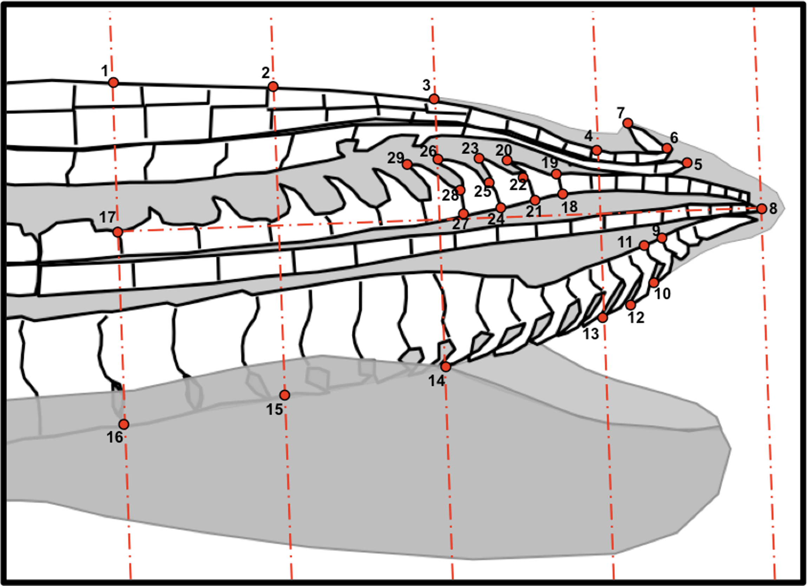

# Dependencies

```{r message=FALSE, warning=FALSE, include=FALSE}
library(car)
library(dplyr)
library(effects)
library(emmeans)
library(geomorph)
library(ggplot2)
library(ggpubr)
library(ggrepel)
library(heplots)
library(HoRM)
library(lme4)
library(nlme)
library(plyr)
library(RColorBrewer)
library(rcompanion)
library(readr)
library(scales)
library(sjstats)
library(stringr)
library(subselect)
```

# Import data

```{r}
# Male gonopodium data
data.m <- read.csv("cavemolly_gonopodium_raw.csv", header=TRUE)
head(data.m)
```

```{r}
#Female gonopore data
data.f <-read.csv(file="cavemolly_gonopore_raw.csv", header = TRUE)
head(data.f)
```

# Male traits

## Gonopodium shape

Geometric morphometric analysis of gonopodium shape

### Auxilary data

This analysis requires a "links" file to connect points during data visualization

```{r}
#Create a links file
lks <- matrix(c(c(1,2,3,4,6,5,6, 8,13,14,15,16,17,4,6,11, 9,18,19,22,23,25,26,29,28,27,24,21,28,25,22),
                c(2,3,4,6,5,8,7,13,14,15,16,17, 1,6,7,12,10,19,20,21,22,24,25,28,27,24,21,18,25,22,19)), ncol = 2)
```

Numbers in link points correspond to the figure below:



### Data preparation

```{r}
#Isolate landmarks
g.tmp <- data.m[,c(10:67)]

#Isolate metadata
g.nam <- data.m[,c(1:10)]

#Isolate specimen IDs
names <- data.m[,1]

#Generate array
coords <- geomorph::arrayspecs(g.tmp[,1:ncol(g.tmp)], 58/2, 2)
dimnames(coords)[[3]] <- names

# Plot raw data prior to alignment
plot_raw <- geomorph::plotAllSpecimens(coords,  mean=TRUE, label=TRUE)
```

### Alignment

First define semi-landmarks (the first and third vectors designate the anchors; the second vector designates the slide)

```{r}
sela <- matrix(c(c(17,1,2,3,17,16,15,14),
                  c( 1,2,3,4,16,15,14,13),
                  c( 2,3,4,8,15,14,13, 8)),
                ncol = 3)
```

Actually align landmarks referencing slides matrix

```{r}
GPA <- gpagen(coords, PrinAxes = T, Proj = T, ProcD = T, curves=sela)
landmark_plot <- plot(GPA, links=lks)
landmark_summary <- summary(GPA)
cons <- landmark_summary$consensus
```

### Run PCA

```{r}
#PCA
ShapePC <- geomorph::gm.prcomp(GPA$coords, phy = NULL)
summary(ShapePC)

#Append scores to data for later use
pc.scores <- ShapePC$x
data.m2 <- cbind(data.m, pc.scores)
```

### MANOVA

```{r}
gdf <- geomorph.data.frame(GPA, h2s = data.m$H2S, cave=data.m$Cave, mass = data.m$logMass) 
fit <- procD.lm(coords ~ mass+h2s+cave+mass*h2s+mass*cave+h2s*cave+mass*h2s*cave, iter = 9999, SS.type = "III", data=gdf)
fit.t <- summary(fit)
fit.t$table
#write.csv(fit.t$table, "results.csv")
```

### Visualization
#### Scatter plot based on PCA scores

```{r}
# Create a data.frame containing individual coordinates
ind_coords = as.data.frame(ShapePC$x)

# Add columns containing IVs
ind_coords$Ind = data.m$Individual.ID
ind_coords$Site = data.m$Pop
ind_coords$Cave = data.m$Cave
ind_coords$H2S = data.m$H2S

# Calculate centroid (average) position for each population
centroid = aggregate(cbind(Comp1, Comp2,Comp3,Comp4) ~ Site, data = ind_coords, FUN = mean)
centroid$Cave = c("Surface", "Cave", "Surface", "Cave")

# Add centroid coordinates to ind_coords dataframe
ind_coords = dplyr::left_join(ind_coords, centroid, by = "Site", suffix = c("",".cen"))

ggplot(data = ind_coords, aes(x = Comp1, y = Comp2))+
  geom_segment(aes(xend = Comp1.cen, yend = Comp2.cen, color = Cave), show.legend = F)+
  geom_point(aes(color = Cave, shape=H2S), size = 2, show.legend = T)+
  geom_label(data = centroid, aes(label = Site), size = 2.5, show.legend = F)+
  theme_classic()+
  labs(x="PC axis 1", y="PC axis 2", fill="Cave vs. surface")+
  scale_fill_manual(values = c("#4D4D4D","#5DA5DA"))+
  scale_colour_manual(values = c("#4D4D4D","#5DA5DA"))
```

#### Shape variation of the gonopodium along each of the PC axes

```{r}
pc1.coor.min <- ShapePC$shapes$shapes.comp1$min
pc1.coor.max <- ShapePC$shapes$shapes.comp1$max
pc2.coor.min <- ShapePC$shapes$shapes.comp2$min
pc2.coor.max <- ShapePC$shapes$shapes.comp2$max

gp <- gridPar(
  pt.bg = "gray",
  pt.size = .5,
  link.col = "gray",
  link.lwd = ,
  link.lty = 1,
  out.col = "gray",
  out.cex = 0.0,
  tar.pt.bg = "black",
  tar.pt.size = .8,
  tar.link.col = "black",
  tar.link.lwd = 1,
  tar.link.lty = 1,
  tar.out.col = "black",
  tar.out.cex = 0.1,
  n.col.cell = 12,
  grid.col = "black",
  grid.lwd = 1,
  grid.lty = 3,
  txt.adj = NULL,
  txt.pos = 1,
  txt.cex = 0.8,
  txt.col = "black"
)

p.pc1.min <- plotRefToTarget(pc1.coor.min, cons, links = lks, mag = 2, gridPars=gp)
p.pc1.max <- plotRefToTarget(pc1.coor.max, cons, links = lks, mag = 2, gridPars=gp)
p.pc2.min <- plotRefToTarget(pc2.coor.min, cons, links = lks, mag = 2, gridPars=gp)
p.pc2.max <- plotRefToTarget(pc2.coor.max, cons, links = lks, mag = 2, gridPars=gp)
```

## Palp
### ANCOVA model

```{r}
palp.m <- lm(log(Palp.SA) ~ (Cave+H2S+logMass), data=data.m)
summary(palp.m)
```

### Extracting and plotting marginal means

```{r warning=FALSE}
ee <- Effect(c("Cave", "H2S"),palp.m) 

mms <- as.data.frame(cbind(ee$fit, ee$se, ee$x))

#Plot marginal means and raw data
ggplot(mms, aes(x=Cave, y=ee$fit, group=H2S, color=Cave, shape=H2S)) + 
    geom_point(data=data.m, aes(x=Cave, y=log(Palp.SA), color=Cave), position = position_jitterdodge(jitter.width = 0.1), alpha=0.4)+
    geom_pointrange(aes(ymin=ee$fit-ee$se*2, ymax=ee$fit+ee$se*2), position = position_dodge(width = 0.2), size=.5) +
    labs(x="Cave", y = "Palp size") +
    scale_color_manual(values=c("#4D4D4D","#5DA5DA", "#4D4D4D","#5DA5DA")) +
    theme_classic()
```

# Female traits

## Run PCA

```{r}
pca.r<-princomp(data.f[c(5:12)], cor=TRUE)
summary(pca.r)
print(pca.r$loadings, cutoff=0)

# Save results
pca.r.loadings <- pca.r$loadings
#write.csv(pca.r.loadings, "femalePCA.csv")

#Append scores to data for later use
scores.r <- pca.r$scores
data.f.r <- cbind(data.f, scores.r)
```


## Scatterplot based on PCA scores 
```{r}
# Create a data.frame containing individual coordinates
ind_coords.f.r = as.data.frame(data.f.r)

# Calculate centroid (average) position for each population
centroid.f.r = aggregate(cbind(Comp.1, Comp.2, Comp.3) ~ pop, data = ind_coords.f.r, FUN = mean)

# Add centroid coordinates to ind_coords dataframe
ind_coords.f.r = left_join(ind_coords.f.r, centroid.f.r, by = "pop", suffix = c("",".cen"))

ggplot(data = ind_coords.f.r, aes(x = Comp.1, y = Comp.2))+
  geom_segment(aes(xend = Comp.1.cen, yend = Comp.2.cen, colour = cave), show.legend = FALSE)+
  geom_point(aes(color = cave, shape=h2s), size = 2, show.legend = FALSE)+
  geom_label(data = centroid.f.r, aes(label = pop), size = 2.5, show.legend = FALSE)+
  theme_classic() +
  labs(x="PC axis 1", y="PC axis 2", fill="Cave vs. surface")+
  scale_fill_manual(values = c("#4D4D4D","#5DA5DA"))+
  scale_colour_manual(values = c("#4D4D4D","#5DA5DA"))
```
## MANOVA on first three PC axes
```{r}
m.f.r <- lm(cbind(Comp.1, Comp.2, Comp.3) ~ (log(Mass) + h2s + cave)^2, data=data.f.r)
fit.r <- Manova(m.f.r, type="III")
summary(fit.r, test = "Wilks")
```
